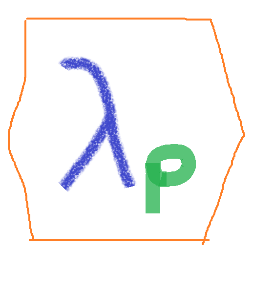

<!-- README.md is generated from README.Rmd. Please edit that file -->

# lambdap 

<!-- badges: start -->

[](https://CRAN.R-project.org/package=lambdap)
[](https://github.com/fhernanb/lambdap/actions)
<!-- badges: end -->

An R package with useful functions to implement the p-value-based
approach to the Box-Cox transformation proposed by Vélez, Correa and
Marmolejo-Ramos (2015)(Vélez, Correa, and Marmolejo-Ramos 2015).

You can visit the [package
website](https://fhernanb.github.io/lambdap/index.html) to explore the
vignettes (articles) and function reference.

## Installation

You can install the released version of lambdap from
[CRAN](https://CRAN.R-project.org) with:

``` r
install.packages("lambdap")
```

And the development version from [GitHub](https://github.com/) with:

``` r
# install.packages("devtools")
devtools::install_github("fhernanb/lambdap")
```
